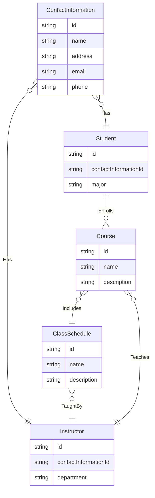

# Scheduling-Classes

Repo support for [SSC - how-would-you-design-this-scheduling-classes](https://www.sqlservercentral.com/articles/how-would-you-design-this-scheduling-classes) exercise.

```mermaid
erDiagram
    Student ||--o{ Course : Enrolls
    Student {
        string id
        string contactInformationId
        string major
    }
    Course }o--|| ClassSchedule : Includes
    Course {
        string id
        string name
        string description
    }
    ClassSchedule }o--|| Instructor : TaughtBy
    ClassSchedule {
        string id
        string name
        string description
    }
    Instructor ||--o{ Course : Teaches
    Instructor {
        string id
        string contactInformationId
        string department
    }

    ContactInformation }o--|| Instructor : Has
    ContactInformation }o--|| Student : Has
    ContactInformation {
        string id
        string name
        string address
        string email
        string phone
    }
```
